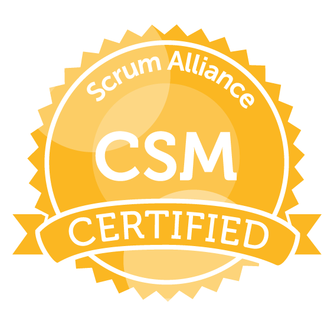
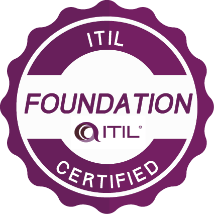
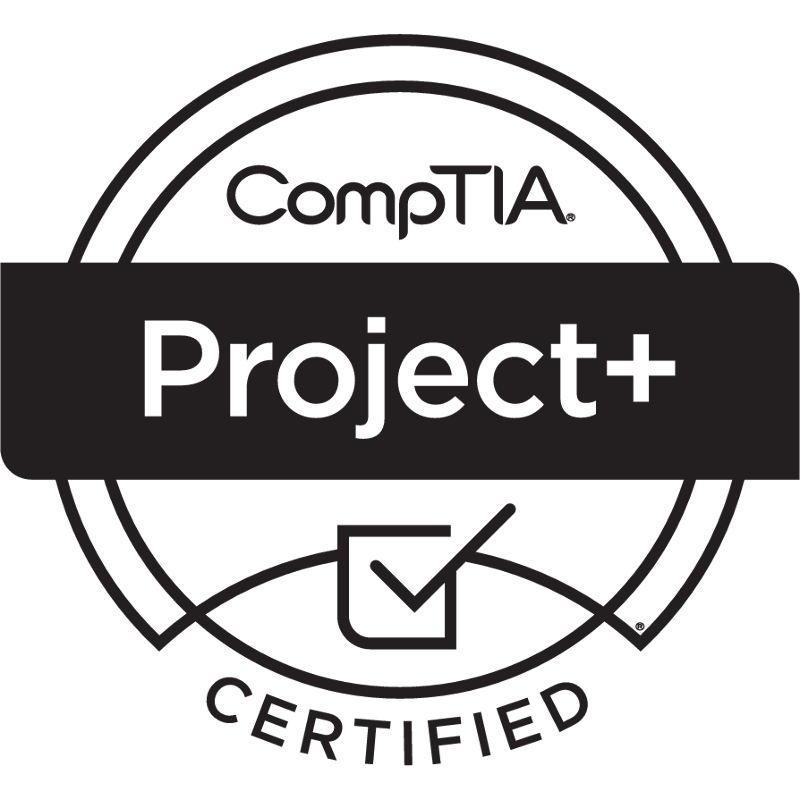
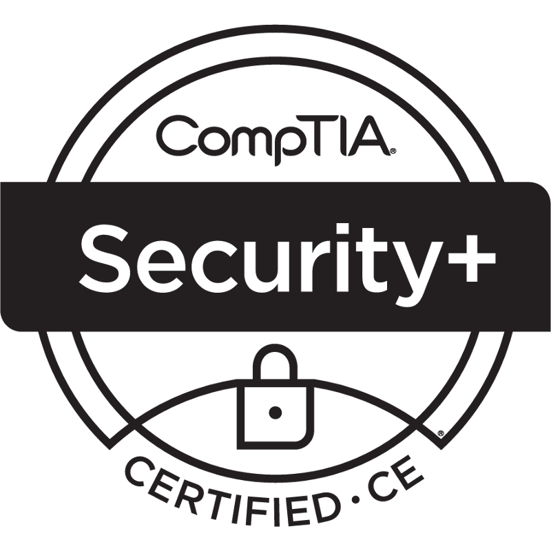
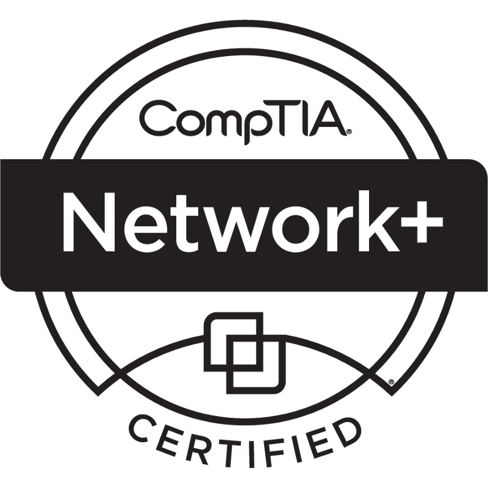

# 👋 Hi, I’m @tcgerlach

       

## Things I’m Learning
- 👮‍♂️ I am studying for a PhD in Criminal Justice / Homeland Security
- 🇨🇳 I am working toward HSK-3 Chinese language certification
  - 你好！我学中文学了十年多了。
  - 我去过了香港和深圳了，很想回去看长城。
  - 如果你看不懂这个，你应该学中文。
  - 我的中文名字是张文山。
  - 我觉得中国文化很有意思。
- 💻 I am studying for the CompTIA CySA+ certification
- :atom: I am learning how to program quantum computers
- 🇯🇵 I recently started learning to speak Japanese
  - 私は少し日本語を話します。 

## Things I Love
- 🤖 Artificial Intelligence
- 🪐 Astronomy
- 💻 Computers
- 💬 Foreign Languages
- 🥷 Martial Arts
- 🧙 Medieval History
- 🎵 Music
- 👨‍👩‍👧‍👦 Social Sciences

## Other Stuff
- 🖼️ I believe laptop stickers are an important part of individual expression
- 📜 I have an odd education which gives me a different perspective from many developers
  - 🕵️‍♂️ Doctor of Philosophy in Criminal Justice / Homeland Security (In Progress)
  - 📈 Master of Business Administration in Information Technology Management
  - 💻 Bachelor of Science in Software Development
  - 🧠 Associate of Science in Psychology
  - 💊 Certificate in Herbal Medicine
  - 🔑 Certificate in Locksmithing
  - 📻 Extensive Training in Radio Communications Systems
- 🎖️ I am a US Army Veteran
- 🎷 I am a musician and play multiple instruments
- 🥋 I have a third degree black belt in Taekwondo
- 📻 I have an Extra Class Ham Radio License
- 🛩️ I have a Small Unmanned Aircraft System (sUAS) Certificate
- 📄 I have numerous certifications
  - ☁️ AWS Certified Solutions Architect
  - 👨‍💼 Six Sigma Green Belt, Certified Scrum Master, ITIL
  - 💻 CompTIA A+, Network+, Security+, PenTest+, Project+
  - 👨‍🔬 CITI Program Responsible Conduct of Research, Human Subjects Research
  - 👨‍💻 CIW Advanced HTML5 and CSS Specialist, User Interface Designer

## Professional Memberships
- 👨‍👩‍👧‍👦 American Sociological Association
- 🧠 Association for the Advancement of Artificial Intelligence
- 🥷 Association of Former Intelligence Officers
- 🔌 Institute of Electrical and Electronics Engineers
- 🤖 IEEE Computational Intelligence Society
- 💻 IEEE Computer Society
 

## Learn More About Me
- 🌎 Connect with me on [LinkedIn](https://linkedin.com/in/tcgerlach)
- 📖 See what [I'm currently reading](https://www.librarything.com/catalog/tcgerlach/currentlyreading)
