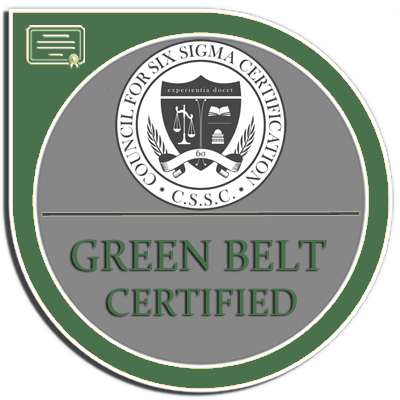
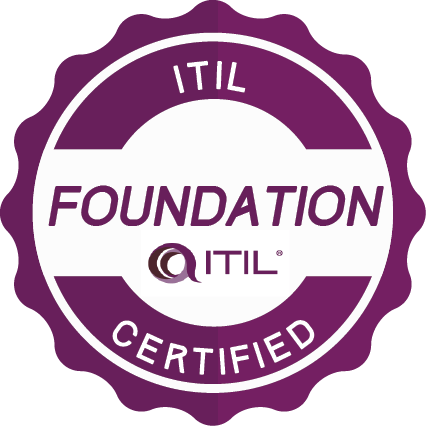
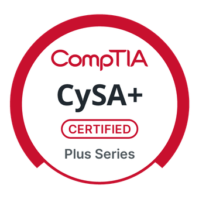
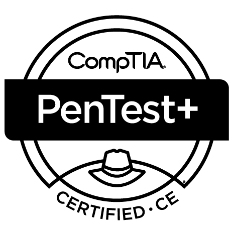
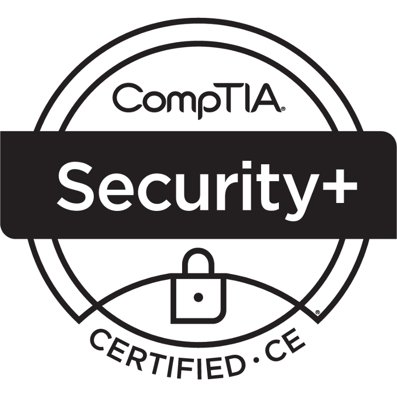
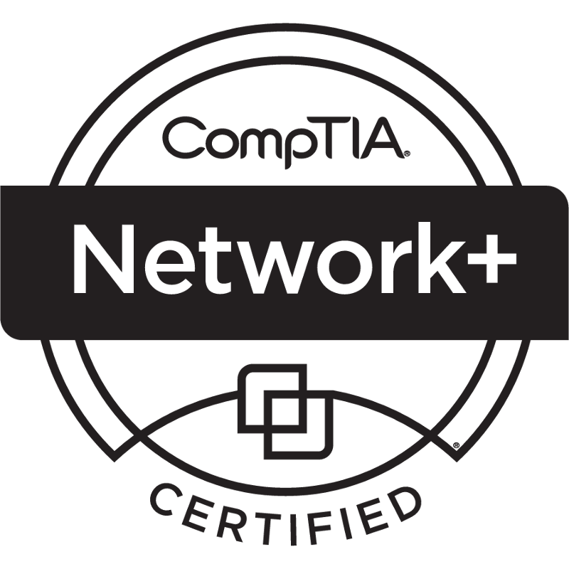

# 👋 Hi, I’m @tcgerlach

       
      

## Things I’m Learning
- 👮‍♂️ I am studying for a PhD in Criminal Justice / Homeland Security
- 💰 I'm studying to become a Certified Anti-Money Laundering Specialist
- :atom: I am learning how to program quantum computers
- ✈️ I am studying for a Recreational Pilot Certificate
- 🥋 I'm training for a 4th degree Master Black Belt

## Languages I'm Currently Studying
- 🇨🇳 Chinese
- 🇫🇷 French
- 🇩🇪 German
- 🇯🇵 Japanese
- 🇮🇷 Persian
- 🇸🇪 Swedish

## Things I Love
- 🤖 Artificial Intelligence
- 🪐 Astronomy
- 💻 Computers
- 💬 Foreign Languages
- 🥷 Martial Arts
- 🧙 Medieval History
- 🎵 Music
- 👨‍👩‍👧‍👦 Social Sciences

## Volunteer Work
- 🧑‍⚖️ *Judge of Election* for Altoona's 11th Ward, 1st Precinct
- 🌳 *Assistant Scoutmaster* with [Boy Scouts of America](https://scouting.org)
- ⛓️ *Prison Monitor* with the [Pennsylvania Prison Society](https://prisonsociety.org)
- 👽 *Field Investigator* with the [Mutual UFO Network](https://mufon.com)
- 👨‍💼 *Mentor* with [American Corporate Partners](https://acp-usa.org)

## Professional Memberships
- 👨‍👩‍👧‍👦 [American Sociological Association](https://www.asanet.org/)
- 🧠 [Association for the Advancement of Artificial Intelligence](https://aaai.org/)
- 🥷 [Association of Former Intelligence Officers](https://www.afio.com/)
- 🔌 [Institute of Electrical and Electronics Engineers](https://ieee.org)
- 🤖 [IEEE Computational Intelligence Society](https://cis.ieee.org)
- 💻 [IEEE Computer Society](https://www.computer.org)
  

## Other Stuff
- 🖼️ I believe laptop stickers are an important part of individual expression
- 📜 I have an odd education which gives me a different perspective from many developers
  - 🕵️‍♂️ Doctor of Philosophy in Criminal Justice / Homeland Security (In Progress)
  - 📈 Master of Business Administration in Information Technology Management
  - 💻 Bachelor of Science in Software Development
  - 🧠 Associate of Science in Psychology
  - 🤖 Certificate in Artificial Intelligence
  - 💊 Diploma in Herbal Medicine
  - 🔑 Diploma in Locksmithing
  - 📻 Extensive Training in Radio Communications Systems
- 🎖️ I am a US Army Veteran
- 🎷 I am a musician and play multiple instruments
- 🥋 I have a third degree black belt in Taekwondo
  - ⚔️ I also have extensive training with short swords 
- 📻 I have an Extra Class Ham Radio License
- 🛩️ I have a Small Unmanned Aircraft System (sUAS) Certificate
- 📄 I have numerous certifications
  - ☁️ AWS Certified Solutions Architect
  - 👨‍💼 Six Sigma Green Belt, Certified Scrum Master, ITIL
  - 💻 CompTIA A+, Network+, Security+, PenTest+, CySA+, Project+
  - 👨‍🔬 CITI Program Responsible Conduct of Research, Human Subjects Research
  - 👨‍💻 CIW Advanced HTML5 and CSS Specialist, User Interface Designer
 

## Learn More About Me
- 🌎 [LinkedIn](https://linkedin.com/in/tcgerlach) - [OrcID](https://orcid.org/0000-0003-4596-2767) - [Credly](https://www.credly.com/users/thomas-gerlach)
- 📖 See what [I'm currently reading](https://www.librarything.com/catalog/tcgerlach/currentlyreading)
